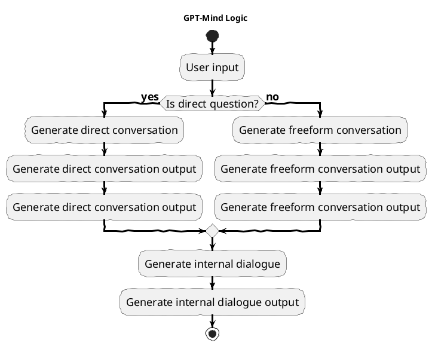

# GPT-Mind: A Multi-Agent Model of Mind

GPT-Mind is a browser-based project that implements a multi-agent model of the human mind. The model is based on the assumption that the mind is an ongoing conversation between multiple aspects of the mind, and that thoughts are the internal representation of the conversation.

The project uses Large Language Models (LLMs) to model the conversation, asking each aspect of mind to predict the next thought. Input into the mind triggers a conversation between aspects of mind, which is about the conversation itself rather than the input. Each aspect of mind has an intensity level that biases itself based on the input. Low intensity levels create disinterested response, while high intensity levels create an urgent engaged response.

## Demo

A demo of GPT-Mind can be found [here](https://gpt-mind.github.io/). You'll need an OpenAI API key to use the demo. You can get one [here](https://beta.openai.com/). If you don't want to use your own ket in the demo, you can use this project to build the project yourself and run it locally.

## Usage

To use GPT-Mind, simply open the `/dist/index.html` file in a web browser or build the project yourself. To build the project, run `npm run build` in the project directory. To start the project in development mode, run `npm run dev` in the project directory.

### OpenAI API Key

You can either enter your key into the message box on every session, or you can edit the `config.js` file to include your key. If you do not have an OpenAI API key, you can get one [here](https://beta.openai.com/). If you enter your key in the config file, you won't have to enter it every time you start a session.

You can then input text into the system and it will respond with an output. The output is generated by a conversation between multiple aspects of mind, and can either be a freeform conversation or a consensus conversation.

Freeform conversation is more likely to occur when the intensity level is low. Consensus conversation is more likely to occur when the intensity level is high and when a direct question is asked.

If a consensus conversation is required, the agents are presented with the input and asked to respond. Then another agent is asked if the statements have consensus. If yes, then the output is the consensus. If no, then the output is the most dominant aspect of mind, or no output if no aspect of mind is dominant or if others are dominant or convincing.

The multiple outputs of the agents are then processed by another agent, who is tasked with deriving the salient thoughts made by the agents, deriving the salient thoughts made by the agents about the conversation itself, and deriving a coherent integrated response as output. The thoughts are then kept in a memory queue and used as input for daydreaming - self-conversation that the system begins performing once input is received and the conversation with the user is over.
 
## Implementation Details

GPT-Mind is implemented using JavaScript in a browser. It uses GPT-3's `text-davinci-003` model to generate text. The project currently consists of a single file, `index.js`, which contains the implementation of the multi-agent model of the mind. If this project is expanded in the future, it will be split into multiple files.

## Features

### Multiple conversing agents

The mind is structured as a collection of multiple agents which engage in conversation to come to consensus to produce perceptual frames. Conversations can either be directed - where the agents are given a specific question to answer - or undirected - where the agents are given a general topic to discuss.

### Agent Conversation

Each agent has access to  GPT-3, which it can use to generate text and make decisions. The agents engage in conversation with one another, with each agent generating a prompt (in the form of a preamble) that requests the other agents to generate a response. The agents then use GPT-3 to generate their responsees.

### Directed Conversation

In direct conversation, the agents are given a specific question to answer. The agents are given a preamble that contains the question, and they are asked to generate a response that answers the question. The agents then use GPT-3 to generate their responses, and the resulting conversation is used to come to a consensus about the current perceptual frame. 

### Concensus-building

The conversation is structured into rounds, where an agent is chosen at random and asked to provide an an answer to the question, which they do using GPT-3. The agen't answer is then used to generate a new question asking the other agents whether they agree with the answer, which they answer using GPT-3.

### Assessing Concensus

The answers are then assessed by another LLM request asking the LLM to derive whether a majority of the agents agree with the answer. If the answer is deemed to be a majority, then the answer is accepted as the final answer. If the answer is deemed to be a minority, then the answer is rejected and the process is repeated.

### Unirected Conversation

In undirected conversation, the agents are given a general topic to discuss. The agents are given a preamble that contains the topic, and they are asked to generate a response that discusses the topic. The agents then use GPT-3 to generate their responses, and the resulting conversation is used to produce a perceptual frame.

### Emotional Agents

The mind is modeled as a collection of multiple agents, each of which sees the world from the perspective of their emotional state, and each of which has a sensitivity level which modulates the agents present response. WHen answering a question, the agents are asked to generate a response that is consistent with their emotional state and sensitivity level, along with a new emotional sensitivity level based on the question.

### Internal Dialogue

The mind engages in internal dialogue after engaging in conversation with a user. The internal dialogue is structured as a set of questions that the mind asks itself, and the mind uses GPT-3 to generate responses to the questions. These questions are then used along with the conversation with the user to come to a consensus about the current perceptual frame.

### Memory Model

The mind possesses both a short and a long-term memory. The short-term memory is managed by the app conducting the conversation, while the long-term memory is managed by a GPT-3 model.

### Short-term memory

The mind includes a short-term memory that is implemented as a keyword-based memory. The memory stores keywords extracted from the conversation, along with the associated context and agent that generated the keyword. The memory fades over time, but if a keyword is accessed multiple times within a few minutes, then it is passed on to a long-term memory model that can remember the keyword for a longer period of time.

### Long-term memory model

The Long-term memory model is the only LLM component which is modified over time using GPT-3's fine-tuning capabilities. The model is fine tuned to act as a keyword-based memory through periodic fine-tuning sessions. The fine-tuning sessions involve the model being presented with a series of prompts, each of which contains a keyword and a context. The model is then asked to generate a response that contains the keyword and the context. The model is then evaluated based on how well it was able to generate a response that contains the keyword and the context. The model is then fine-tuned to improve its performance on the prompts. The fine-tuning process is repeated periodically to improve the model's performance.

### Process of Cognition

The process of cognitiion involves the mind engaging in conversation with itself to come to a consensus about the current perceptual frame. The process of cognition is structured into three phases: perception, inference, and action.

## Future Work

There is a lot of potential for future work on GPT-Mind: 

- **Control Flow**: **One area of future work could be to incorporate more sophisticated control flow into the agent, adding additional conversational structures and allowing the agent to make decisions based on the conversation. 
- **Memory**: Another area of future work could be to incorporate more sophisticated memory models into the agent, allowing the agent to remember previous conversations and use them to inform the current conversation. 
- **better models**: Another area of future work could be to incorporate more sophisticated models of the mind into the agent, allowing the agent to model the mind as a collection of multiple agents, each of which has its own memory and personality.
- **message degradation**: Message history could be degraded over time via progressively removing details from the message, gaining the ability to remember more messages over time, at a cost of accuracy.
- **Internet connectivity**: An angent could be tasked with retrieving data from the internet, and then using that data to inform the conversation.
- **AI-initiated actions**: An agent could be given the ability to respond to the AI's thoughts and questions, allowing the agent to engage in a conversation with the user or direct themselves to perform a task.
- **shorthand data compression**: The agent could be given the ability to compress data using shorthand, allowing the agent to store more data in memory as well as communicate more efficiently with the user or other agents.
- **mixed-model communication:** The agent could be given the ability to communicate with other agents using a mixed-model approach, where the agent uses a combination of GPT-3 and a text-to-image model to communicate with other the user or other agents. This would allow the agent to daydream using imagery,which can be interpreted back to text using a image-to-text model. This could also me used as a means to 'show' the user what the agent is thinking, which could be useful for debugging or for providing feedback to the user. This could also be used by the user to better communicate with the agent, allowing the user to provide more detailed feedback to the agent.
  
Overall, GPT-Mind provides a unique and interesting way to explore the workings of the human mind, and the project has a lot of potential for future research and development.

## Diagrams - Logic and Flow

# Conclusion

GPT-Mind is an interesting project that explores the possibility of using GPT-3 to model the human mind. The project has a lot of potential for future research and development, and I'm excited to see what the future holds for GPT-Mind. 

# References

https://en.wikipedia.org/wiki/Artificial\_intelligence

https://en.wikipedia.org/wiki/Deep\_learning

https://en.wikipedia.org/wiki/Generative\_pre-trained\_transformer

https://en.wikipedia.org/wiki/Generative\_adversarial\_network

https://en.wikipedia.org/wiki/Transformer\_(machine\_learning\_model)

https://en.wikipedia.org/wiki/Attention\_\(machine\_learning\)

https://en.wikipedia.org/wiki/Long\_short-term\_memory

https://en.wikipedia.org/wiki/Recurrent\_neura\_network
